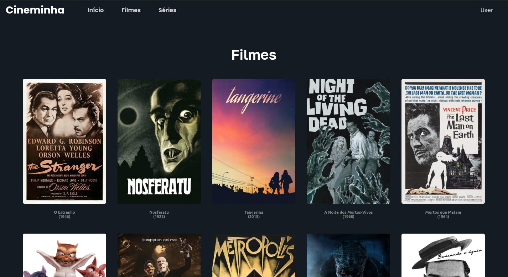

# Cineminha 

## Principais Funcionalidades:

  - Autenticação Completa de Usuários:
    - Cadastro e Login (email/senha).
    - Login social com Google e GitHub.
    - Recuperação de senha (gerenciada pelo Supabase).
    - Redefinição de senha após recuperação.
    - Logout seguro.
  - Navegação e Descoberta de Conteúdo:
    - Página inicial com banner de boas-vindas (diferente para usuários logados e não logados).
    - Listagem separada para Filmes e Séries.
    - Páginas de detalhes dedicadas para cada filme e série.
  - Visualização de Conteúdo:
    - Filmes: Exibição de detalhes (capa, título, ano, sinopse) e botão "Assistir" que abre um player embutido.
    - Séries: Exibição de detalhes (capa, título, ano, sinopse), seleção de temporadas e episódios, com player embutido para cada episódio.
    - Player de vídeo (iframe) com autoplay e mute configurados.
  - Interface de Usuário Moderna e Responsiva:
    - Modais para Login, Cadastro, Esqueci Minha Senha e Redefinir Senha.
    - Header responsivo com menu mobile e dropdown para perfil do usuário (logout).
    - Feedback visual com overlay de carregamento global durante operações assíncronas.
    - Controles de visibilidade de senha nos formulários.
    - Botão para expandir/recolher sinopse em telas menores.
  - Gerenciamento de Estado:
    - Utilização eficiente de useState, useEffect, useCallback para gerenciar o estado dos componentes e a lógica da interface.
    - Context API (LoadingContext) para gerenciamento do estado de carregamento global.

## Tecnologias Utilizadas:

  - Front-end: React, Next.js (App Router - "use client")
  - Estilização: SCSS Modules
  - Backend (BaaS): Supabase (para autenticação)
  - Ícones: React Icons
  - Hooks Personalizados: useModalScrollLock
  - Gerenciamento de Navegação: Next.js Router

Este projeto demonstra a construção de uma aplicação web interativa e rica em funcionalidades, com foco na experiência do usuário e integração com serviços de backend como o Supabase para autenticação."
